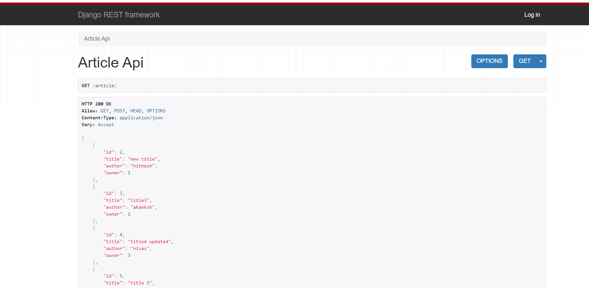
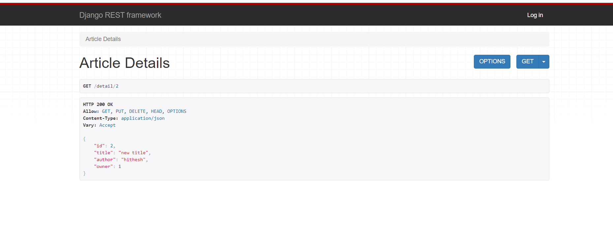

##DjangoRestApi

Rest Api Project to GET ,PUT ,POST and DELETE Articles hosted on pythonanywhere.com
[Click Here To View Project](https://raodilip54.pythonanywhere.com/article/)

Usage to get specific article: 
Id is the primary key of articles .
Articles are available starting from id 2.
To get articles with different id , just put the number in place of id-no in below link. 
raodilip54.pythonanywhere.com/detail/id-no
[Click Here To Get details of  article with id2](https://raodilip54.pythonanywhere.com/detail/2)

[Click Here To Get all Users](https://raodilip54.pythonanywhere.com/users/)

Usage to get specific Users: 
Id is the primary key of Users .
Only 3 Users with id 1,2,3 are available.
To get articles with different id , just put the number in place of id-no in below link. 
https://raodilip54.pythonanywhere.com/users/id-no/
[Click Here To Get User with id 1](https://raodilip54.pythonanywhere.com/users/1)

Note : Only Logged in Users can do POST ,PUT and DELETE
